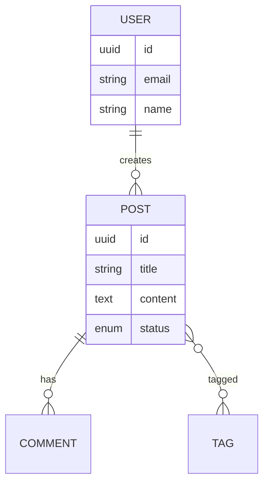
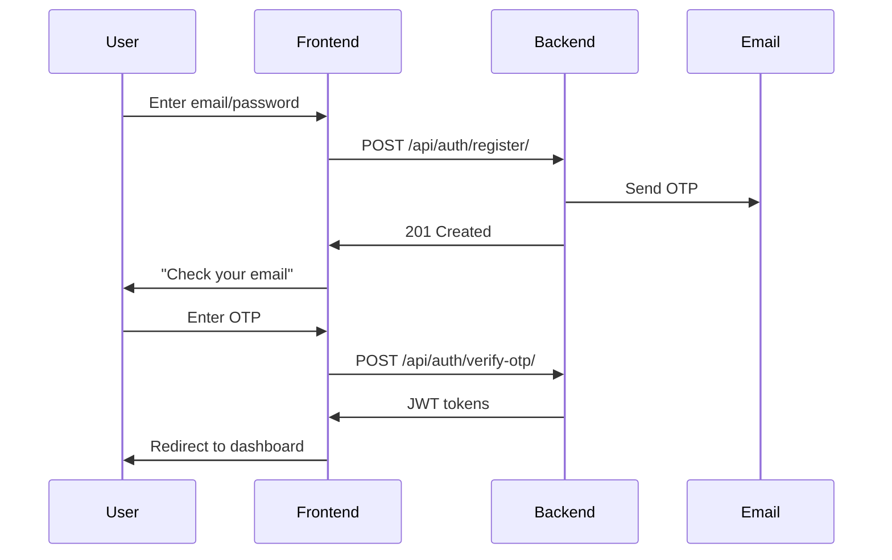

# Planning Tool Transformation Plan

**Date**: 2025-11-07
**Goal**: Transform "Scaffolding System" into "Planning-First Development System"
**Philosophy**: Planning is the bottleneck. Good plans enable agent execution.

---

## Phase 1: Rename & Rebrand (Immediate)

### 1.1 File Renames
- [ ] `.claude/commands/scaffold-app.md` → `plan-app.md`
- [ ] `.claude/SCAFFOLDING_GUIDE.md` → `PLANNING_GUIDE.md`
- [ ] Update all internal references

### 1.2 Documentation Updates
- [ ] Update `README.md` - Replace "scaffolding" with "planning"
- [ ] Update `CLAUDE.md` - New description of planning tool
- [ ] Update `.claude/README.md` - Planning tool as primary feature

### 1.3 Command Behavior
- [ ] `/plan-app` becomes primary command
- [ ] `/scaffold-app` becomes alias (deprecated) with warning
- [ ] Add deprecation notice: "Use /plan-app instead"

---

## Phase 2: Enhance Planning Capabilities (Next)

### 2.1 Pre-Built App Templates
Create 5 production-ready templates:

#### Template 1: Blog Platform
**Files**: `templates/blog/`
- `REQUIREMENTS.md` - Pre-written requirements
- `PROJECT_PLAN.md` - 4 phases, 11 sessions
- `tasks/PHASE_*.md` - Session breakdowns
- **Customization Points**:
  - Comments (Yes/No)
  - Categories/Tags (Yes/No)
  - Multi-author (Yes/No)
  - Media uploads (Yes/No)

#### Template 2: E-Commerce Store
**Files**: `templates/ecommerce/`
- Products, Orders, Cart, Payments
- **Customization Points**:
  - Product variants (Yes/No)
  - Inventory tracking (Yes/No)
  - Subscriptions (Yes/No)
  - Reviews/Ratings (Yes/No)

#### Template 3: SaaS Multi-Tenant
**Files**: `templates/saas/`
- Organizations, Teams, Workspaces
- **Customization Points**:
  - Billing (Stripe/Manual)
  - Team size limits
  - Role complexity (Basic/Advanced)

#### Template 4: Social Network
**Files**: `templates/social/`
- Posts, Friends, Feeds, Notifications
- **Customization Points**:
  - Direct messaging (Yes/No)
  - Groups/Communities (Yes/No)
  - Media sharing (Photos/Videos)

#### Template 5: Project Management
**Files**: `templates/projectmanagement/`
- Projects, Tasks, Kanban Boards
- **Customization Points**:
  - Time tracking (Yes/No)
  - Gantt charts (Yes/No)
  - Team collaboration level

### 2.2 Template Selection Flow
```
/plan-app
→ "Start from template or from scratch?"
  [1] Blog Platform
  [2] E-Commerce Store
  [3] SaaS Multi-Tenant
  [4] Social Network
  [5] Project Management
  [6] Start from Scratch

User selects [1] Blog Platform
→ "Customize your blog:"
  - Enable comments? [Y/n]
  - Enable categories/tags? [Y/n]
  - Multi-author support? [y/N]
  - Media uploads (images/videos)? [Y/n]

→ Generates customized plan in 2 minutes vs 15 minutes
→ User reviews → Approves → Ready for execution
```

### 2.3 Visual Enhancements
Add to generated plans:

**Mermaid ERD Diagrams**:
```markdown
### Data Model Visualization

```

**Workflow Diagrams**:
```markdown
### User Registration Flow

```

### 2.4 Platform-Specific Feature Selection

**Problem**: Mobile apps rarely have 1:1 feature parity with web. Often you have 10 web features but only need 3 in mobile.

**Solution**: Enhanced discovery flow with selective feature planning per platform.

#### Discovery Questions

After gathering all features, ask:

```
Mobile requirements?
  [1] Web only (no mobile app)
  [2] Mobile with full feature parity (all web features in mobile)
  [3] Mobile with selective features (choose which features)
  [4] Mobile-first (mobile is primary, web is secondary)
```

If user selects **[3] Mobile with selective features**:

```
You mentioned these features for web:
  - Product catalog
  - Shopping cart
  - Checkout
  - Order management
  - Admin dashboard
  - Analytics
  - Inventory management
  - Bulk upload
  - Customer support chat
  - Email campaigns

Which features do you need in mobile app? (multi-select)
  [✓] Product catalog
  [✓] Shopping cart
  [✓] Checkout
  [✓] Order tracking
  [ ] Admin dashboard
  [ ] Analytics
  [ ] Inventory management
  [ ] Bulk upload
  [ ] Customer support chat
  [ ] Email campaigns

Any mobile-specific features not in web? (multi-select)
  [✓] Push notifications (order updates)
  [✓] Biometric login (Face ID / fingerprint)
  [✓] Offline mode (browse cached products)
  [ ] Camera (scan barcodes)
  [ ] Geolocation (nearby stores)
  [ ] Background sync
  [ ] Share extensions
```

#### Requirements Generation Enhancements

**Platform Feature Matrix** (added to `REQUIREMENTS.md`):

```markdown
## Platform Feature Matrix

| Feature | Web | Mobile | Implementation Notes |
|---------|-----|--------|---------------------|
| Product catalog | ✅ | ✅ | Same API, different UI (grid vs infinite scroll) |
| Shopping cart | ✅ | ✅ | Web: full page, Mobile: bottom sheet |
| Checkout | ✅ | ✅ | Web: multi-step form, Mobile: single-page flow |
| Order tracking | ✅ | ✅ | Mobile adds push notifications |
| Admin dashboard | ✅ | ❌ | Web only - complex UI, desktop workflow |
| Analytics | ✅ | ❌ | Web only - data visualization, desktop workflow |
| Inventory management | ✅ | ❌ | Web only - bulk operations |
| Bulk upload | ✅ | ❌ | Web only - file handling, desktop workflow |
| Customer support chat | ✅ | ❌ | Web only - multi-window support needed |
| Email campaigns | ✅ | ❌ | Web only - rich text editor, desktop workflow |
| Push notifications | ❌ | ✅ | Mobile only - FCM/APNS |
| Biometric login | ❌ | ✅ | Mobile only - Face ID/Touch ID |
| Offline mode | ❌ | ✅ | Mobile only - AsyncStorage/WatermelonDB |

### Mobile-Specific Considerations

#### Features Included in Mobile (4 core + 3 mobile-specific)

**Core Features (from web):**
1. **Product Catalog**
   - UI: Simplified grid view with infinite scroll
   - Offline: Cache last 50 products in AsyncStorage
   - Search: Basic text search (no advanced filters)

2. **Shopping Cart**
   - UI: Bottom sheet (vs full page on web)
   - Actions: Swipe-to-remove items
   - Persistence: AsyncStorage (survives app restart)

3. **Checkout**
   - UI: Single-page flow (vs multi-step on web)
   - Payment: Apple Pay/Google Pay integration
   - Address: Autofill from device contacts

4. **Order Tracking**
   - UI: Timeline view with status updates
   - Real-time: Push notifications on status changes
   - Offline: Cache active orders

**Mobile-Specific Features:**
1. **Push Notifications**
   - Order status updates (shipped, delivered)
   - Promotional offers (optional, user can disable)
   - Abandoned cart reminders
   - Implementation: FCM (Android) + APNS (iOS)

2. **Biometric Login**
   - Face ID (iOS) / Face Unlock (Android)
   - Touch ID / Fingerprint
   - Fallback to PIN/password
   - Implementation: expo-local-authentication

3. **Offline Mode**
   - Browse cached product catalog
   - Add to cart while offline (syncs when online)
   - View past orders
   - Implementation: AsyncStorage + WatermelonDB + React Query

#### Features Excluded from Mobile

**Rationale for exclusions:**
- **Admin Dashboard**: Complex UI, multi-tab workflows, desktop-oriented
- **Analytics**: Data visualization, large tables, export functionality
- **Inventory Management**: Bulk operations, spreadsheet-like UI
- **Bulk Upload**: File handling, CSV parsing, desktop workflow
- **Customer Support Chat**: Support team uses desktop, multi-window support
- **Email Campaigns**: Rich text editor, template management, desktop workflow

**User guidance**: "Use web app for these admin/management features"
```

#### Phase Task Generation Adjustments

**`PHASE_3_MOBILE_APP.md`** generation logic:

1. **Only generate sessions for selected mobile features**
   - If "Admin dashboard" excluded → Skip admin UI sessions
   - If "Analytics" excluded → Skip charts/reports sessions

2. **Add mobile-specific sessions**
   - Session X: Push Notifications (FCM/APNS setup, notification handling)
   - Session Y: Biometric Authentication (expo-local-authentication, secure storage)
   - Session Z: Offline Mode (AsyncStorage, WatermelonDB, sync strategies)

3. **Document web vs mobile differences**
   ```markdown
   ## Session 1: Product Catalog (Mobile)

   **Web Differences:**
   - Web has 20 items per page with pagination
   - Mobile uses infinite scroll (10 items per batch)
   - Web has advanced filters (price range, categories, tags)
   - Mobile has basic search only (performance on mobile networks)
   - Web has grid/list toggle
   - Mobile is grid-only (optimized for touch)
   ```

4. **API Reuse Documentation**
   ```markdown
   ### API Endpoints (Shared with Web)
   - GET /api/products/ (same endpoint, mobile uses `?limit=10`)
   - POST /api/cart/items/ (same endpoint)
   - POST /api/orders/ (same endpoint)

   ### Mobile-Specific API Endpoints
   - POST /api/devices/register/ (FCM/APNS device tokens)
   - POST /api/auth/biometric/ (biometric challenge/response)
   - GET /api/products/offline/ (optimized payload for offline caching)
   ```

#### Example Output

**E-commerce app with selective mobile features:**

```
Web: 10 features → 5 phases, 18 sessions
Mobile: 4 features + 3 mobile-specific → 2 phases, 8 sessions

Total: 26 sessions vs 35+ if full parity assumed
Time savings: ~15-20 hours
```

#### Benefits

1. **Realistic Planning**: Plans match real-world mobile app scopes
2. **Reduced Complexity**: Don't build features mobile users won't use
3. **Faster Time-to-Market**: Focus mobile dev on core user workflows
4. **Clear Scope**: Team knows exactly what's in/out for mobile
5. **API Efficiency**: Documents which endpoints are shared vs platform-specific

---

## Phase 3: Agent Integration (Future)

### 3.1 Execution Agents
Create specialized agents that read generated plans:

**Backend Agent** (`backend-builder`):
- Reads `REQUIREMENTS.md`
- Executes `PHASE_1_BACKEND_FOUNDATION.md`
- Follows TDD workflow exactly as documented
- Commits after each session

**Frontend Agent** (`frontend-builder`):
- Reads `REQUIREMENTS.md`
- Executes `PHASE_2_FRONTEND_FOUNDATION.md`
- Generates components from specifications
- Commits after each session

**Integration Agent** (`integration-tester`):
- Reads `PHASE_3_INTEGRATION_TESTING.md`
- Writes E2E tests
- Verifies workflows
- Reports issues

### 3.2 Agent Invocation
```
# After planning is approved
/execute-phase-1
→ Launches backend-builder agent
→ Agent reads PHASE_1_BACKEND_FOUNDATION.md
→ Follows session-by-session execution
→ Reports progress + blockers

/execute-phase-2
→ Launches frontend-builder agent
→ Agent reads PHASE_2_FRONTEND_FOUNDATION.md
→ Builds components + views
→ Reports progress
```

### 3.3 Human-in-the-Loop
- Agent proposes implementation
- User reviews + approves
- Agent commits
- Repeat for next session

---

## Phase 4: Advanced Planning Features (Long-Term)

### 4.1 Complexity Calculator
Analyzes requirements → Estimates:
- Number of models/serializers/components
- Expected test count
- Estimated sessions
- Estimated total time

**Example Output**:
```
Complexity Analysis:
- Models: 8 (User, Post, Comment, Category, Tag, Like, Notification, Media)
- API Endpoints: 24
- Components: 18
- Estimated Sessions: 12
- Estimated Time: 18-24 hours
- Test Count: ~350 tests
```

### 4.2 Dependency Graph
Visual representation of:
- Which sessions depend on others
- Critical path
- Parallelization opportunities

**Example**:
```
Session 1 (Models) → Session 2 (Serializers) → Session 4 (Permissions)
                   ↘ Session 3 (Business Logic) ↗

Frontend can start after Session 2 (API client generation)
```

### 4.3 Progress Tracking
Live dashboard showing:
- Sessions completed
- Current session
- Blockers
- Overall % complete

### 4.4 Risk Analysis
Identifies potential issues:
- Complex relationships (many-to-many)
- Performance bottlenecks (N+1 queries)
- Security concerns (permissions complexity)
- Third-party integration risks

---

## Success Metrics

### Planning Quality
- [ ] Plans are comprehensive (all entities, endpoints, components defined)
- [ ] Plans are executable (agents can follow them)
- [ ] Plans are understandable (user knows what's being built)
- [ ] Plans save time (faster planning than manual)

### User Experience
- [ ] Template-based planning: <5 minutes
- [ ] From-scratch planning: <15 minutes
- [ ] User approval before execution
- [ ] Clear progress visibility

### Agent Execution
- [ ] Agents can execute plans without human intervention (for happy path)
- [ ] Agents ask for help when blocked
- [ ] Agents follow TDD strictly
- [ ] Agents commit incrementally

---

## Migration Strategy

### Step 1: Soft Launch (Keep Both)
- Add `/plan-app` as new command
- Keep `/scaffold-app` with deprecation notice
- Update docs to recommend `/plan-app`

### Step 2: User Feedback
- Collect feedback on planning flow
- Iterate on templates
- Refine question quality

### Step 3: Full Migration
- Remove `/scaffold-app`
- `/plan-app` is the only planning command
- All docs updated

---

## Timeline

### Week 1: Rename & Rebrand ✅ COMPLETED
- ✅ Rename files (scaffold-app.md → plan-app.md)
- ✅ Update documentation (all references updated)
- ✅ Philosophy shift to planning-first
- ✅ Created transformation roadmap

### Week 2-4: Enhanced Planning Capabilities

- **Week 2**: Pre-built app templates (5 templates) ✅ COMPLETED
  - ✅ Blog Platform template
  - ✅ E-Commerce Store template
  - ✅ SaaS Multi-Tenant template
  - ✅ Social Network template
  - ✅ Project Management template
  - ✅ Template selection flow implementation

- **Week 3**: Platform-Specific Feature Selection ✅ COMPLETED
  - ✅ Implemented 4-option mobile strategy (web-only, full parity, selective, mobile-first)
  - ✅ Multi-select feature discovery for selective mobile
  - ✅ Platform Feature Matrix generation in REQUIREMENTS.md
  - ✅ Mobile-specific vs web-specific logic
  - ✅ Mobile-specific features list (push, biometric, offline, camera, geolocation, etc.)
  - ✅ API reuse documentation (shared vs platform-specific endpoints)
  - ✅ Web vs mobile workflow differences documentation
  - ✅ Updated plan-app.md with Phase 1.5
  - ✅ Updated PLANNING_GUIDE.md with examples

- **Week 4**: Visual Enhancements (NEXT)
  - Mermaid ERD diagrams for data models
  - Sequence diagrams for workflows
  - Dependency graphs for sessions
  - Test rendering in markdown viewers

### Future: Agent Integration
- Design agent architecture
- Implement backend-builder agent
- Implement frontend-builder agent
- Implement mobile-builder agent
- Test agent execution
- Human-in-the-loop workflows

---

## Open Questions

1. **Template Storage**: Git submodule or in-repo?
2. **Template Format**: Markdown with YAML frontmatter or pure markdown?
3. **Agent Architecture**: Task tool or specialized agents?
4. **Progress Tracking**: In markdown files or separate system?

---

**Next Action**: Start with Phase 1 (Rename & Rebrand)
