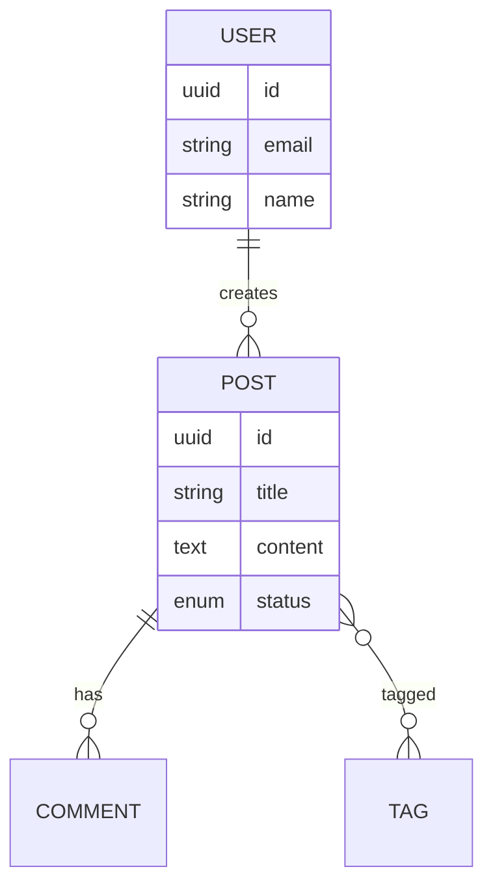
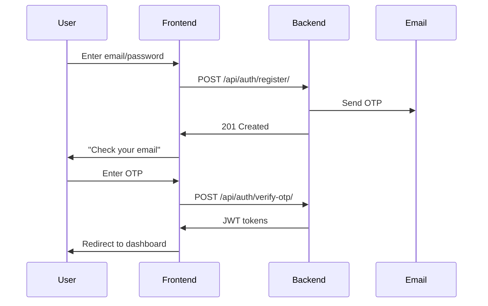

# Planning Tool Transformation Plan

**Date**: 2025-11-07
**Goal**: Transform "Scaffolding System" into "Planning-First Development System"
**Philosophy**: Planning is the bottleneck. Good plans enable agent execution.

---

## Phase 1: Rename & Rebrand (Immediate)

### 1.1 File Renames
- [ ] `.claude/commands/scaffold-app.md` → `plan-app.md`
- [ ] `.claude/SCAFFOLDING_GUIDE.md` → `PLANNING_GUIDE.md`
- [ ] Update all internal references

### 1.2 Documentation Updates
- [ ] Update `README.md` - Replace "scaffolding" with "planning"
- [ ] Update `CLAUDE.md` - New description of planning tool
- [ ] Update `.claude/README.md` - Planning tool as primary feature

### 1.3 Command Behavior
- [ ] `/plan-app` becomes primary command
- [ ] `/scaffold-app` becomes alias (deprecated) with warning
- [ ] Add deprecation notice: "Use /plan-app instead"

---

## Phase 2: Enhance Planning Capabilities (Next)

### 2.1 Pre-Built App Templates
Create 5 production-ready templates:

#### Template 1: Blog Platform
**Files**: `templates/blog/`
- `REQUIREMENTS.md` - Pre-written requirements
- `PROJECT_PLAN.md` - 4 phases, 11 sessions
- `tasks/PHASE_*.md` - Session breakdowns
- **Customization Points**:
  - Comments (Yes/No)
  - Categories/Tags (Yes/No)
  - Multi-author (Yes/No)
  - Media uploads (Yes/No)

#### Template 2: E-Commerce Store
**Files**: `templates/ecommerce/`
- Products, Orders, Cart, Payments
- **Customization Points**:
  - Product variants (Yes/No)
  - Inventory tracking (Yes/No)
  - Subscriptions (Yes/No)
  - Reviews/Ratings (Yes/No)

#### Template 3: SaaS Multi-Tenant
**Files**: `templates/saas/`
- Organizations, Teams, Workspaces
- **Customization Points**:
  - Billing (Stripe/Manual)
  - Team size limits
  - Role complexity (Basic/Advanced)

#### Template 4: Social Network
**Files**: `templates/social/`
- Posts, Friends, Feeds, Notifications
- **Customization Points**:
  - Direct messaging (Yes/No)
  - Groups/Communities (Yes/No)
  - Media sharing (Photos/Videos)

#### Template 5: Project Management
**Files**: `templates/projectmanagement/`
- Projects, Tasks, Kanban Boards
- **Customization Points**:
  - Time tracking (Yes/No)
  - Gantt charts (Yes/No)
  - Team collaboration level

### 2.2 Template Selection Flow
```
/plan-app
→ "Start from template or from scratch?"
  [1] Blog Platform
  [2] E-Commerce Store
  [3] SaaS Multi-Tenant
  [4] Social Network
  [5] Project Management
  [6] Start from Scratch

User selects [1] Blog Platform
→ "Customize your blog:"
  - Enable comments? [Y/n]
  - Enable categories/tags? [Y/n]
  - Multi-author support? [y/N]
  - Media uploads (images/videos)? [Y/n]

→ Generates customized plan in 2 minutes vs 15 minutes
→ User reviews → Approves → Ready for execution
```

### 2.3 Visual Enhancements
Add to generated plans:

**Mermaid ERD Diagrams**:
```markdown
### Data Model Visualization

```

**Workflow Diagrams**:
```markdown
### User Registration Flow

```

---

## Phase 3: Agent Integration (Future)

### 3.1 Execution Agents
Create specialized agents that read generated plans:

**Backend Agent** (`backend-builder`):
- Reads `REQUIREMENTS.md`
- Executes `PHASE_1_BACKEND_FOUNDATION.md`
- Follows TDD workflow exactly as documented
- Commits after each session

**Frontend Agent** (`frontend-builder`):
- Reads `REQUIREMENTS.md`
- Executes `PHASE_2_FRONTEND_FOUNDATION.md`
- Generates components from specifications
- Commits after each session

**Integration Agent** (`integration-tester`):
- Reads `PHASE_3_INTEGRATION_TESTING.md`
- Writes E2E tests
- Verifies workflows
- Reports issues

### 3.2 Agent Invocation
```
# After planning is approved
/execute-phase-1
→ Launches backend-builder agent
→ Agent reads PHASE_1_BACKEND_FOUNDATION.md
→ Follows session-by-session execution
→ Reports progress + blockers

/execute-phase-2
→ Launches frontend-builder agent
→ Agent reads PHASE_2_FRONTEND_FOUNDATION.md
→ Builds components + views
→ Reports progress
```

### 3.3 Human-in-the-Loop
- Agent proposes implementation
- User reviews + approves
- Agent commits
- Repeat for next session

---

## Phase 4: Advanced Planning Features (Long-Term)

### 4.1 Complexity Calculator
Analyzes requirements → Estimates:
- Number of models/serializers/components
- Expected test count
- Estimated sessions
- Estimated total time

**Example Output**:
```
Complexity Analysis:
- Models: 8 (User, Post, Comment, Category, Tag, Like, Notification, Media)
- API Endpoints: 24
- Components: 18
- Estimated Sessions: 12
- Estimated Time: 18-24 hours
- Test Count: ~350 tests
```

### 4.2 Dependency Graph
Visual representation of:
- Which sessions depend on others
- Critical path
- Parallelization opportunities

**Example**:
```
Session 1 (Models) → Session 2 (Serializers) → Session 4 (Permissions)
                   ↘ Session 3 (Business Logic) ↗

Frontend can start after Session 2 (API client generation)
```

### 4.3 Progress Tracking
Live dashboard showing:
- Sessions completed
- Current session
- Blockers
- Overall % complete

### 4.4 Risk Analysis
Identifies potential issues:
- Complex relationships (many-to-many)
- Performance bottlenecks (N+1 queries)
- Security concerns (permissions complexity)
- Third-party integration risks

---

## Success Metrics

### Planning Quality
- [ ] Plans are comprehensive (all entities, endpoints, components defined)
- [ ] Plans are executable (agents can follow them)
- [ ] Plans are understandable (user knows what's being built)
- [ ] Plans save time (faster planning than manual)

### User Experience
- [ ] Template-based planning: <5 minutes
- [ ] From-scratch planning: <15 minutes
- [ ] User approval before execution
- [ ] Clear progress visibility

### Agent Execution
- [ ] Agents can execute plans without human intervention (for happy path)
- [ ] Agents ask for help when blocked
- [ ] Agents follow TDD strictly
- [ ] Agents commit incrementally

---

## Migration Strategy

### Step 1: Soft Launch (Keep Both)
- Add `/plan-app` as new command
- Keep `/scaffold-app` with deprecation notice
- Update docs to recommend `/plan-app`

### Step 2: User Feedback
- Collect feedback on planning flow
- Iterate on templates
- Refine question quality

### Step 3: Full Migration
- Remove `/scaffold-app`
- `/plan-app` is the only planning command
- All docs updated

---

## Timeline

### Week 1: Rename & Rebrand
- Rename files
- Update documentation
- Deprecate old command

### Week 2-3: Templates
- Create 5 app templates
- Test template customization flow
- Document template usage

### Week 4: Visual Enhancements
- Add Mermaid diagrams to generated plans
- Add workflow visualizations
- Test rendering in markdown viewers

### Future: Agent Integration
- Design agent architecture
- Implement backend-builder agent
- Implement frontend-builder agent
- Test agent execution

---

## Open Questions

1. **Template Storage**: Git submodule or in-repo?
2. **Template Format**: Markdown with YAML frontmatter or pure markdown?
3. **Agent Architecture**: Task tool or specialized agents?
4. **Progress Tracking**: In markdown files or separate system?

---

**Next Action**: Start with Phase 1 (Rename & Rebrand)
